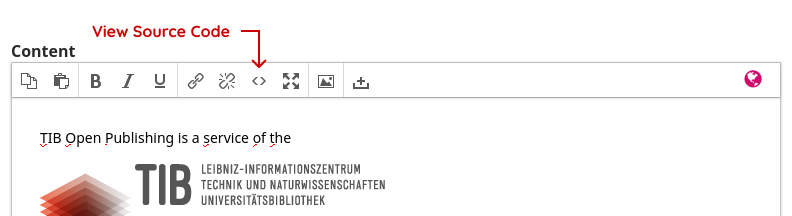

# OJS Theme for TIB Open Publishing

A custom [OJS](https://pkp.sfu.ca/software/ojs) theme for [TIB Open Publishing](https://www.tib-op.org) and the journals and conferences hosted by the service.

## Requirements

- OJS 3.3.0-20+
- The [partnerLogos](https://github.com/NateWr/partnerLogos) plugin should be installed and enabled.

## Usage

Clone this repository into the `plugins/themes` directory in OJS. Then run the following commands from the root directory of the project.

Install dependencies.

```
npm install
```

Build JS/CSS assets.

```
npm run build
```

## Setup

Follow these steps when setting the theme up in a new environment.

### Site Setup

1. Go to **Administration > Site Settings > Plugins** and install and enable the theme as well as the Partner Logos plugin.
2. Go to **Administration > Site Settings > Appearance** and select the theme. While on the same page, set the **Colour** to `#005C5f` and select the **Conference Proceedings.
3. Go to **Administration > Site Settings > Appearance > Setup** and upload the TIB Open Publishing Logo.
4. Go to **Administration > Site Settings > Site Setup > Information > About the Site** and enter a brief description of the service.
5. Go to **Administration > Site Settings > Site Setup > Navigation > Add Menu**. Create a menu and assign it to the `policy` area in the **Active Theme Navigation Areas** dropdown. Add links to this menu pointing to your pages about accessibility, privacy, etc.
6. Go to **Administration > Site Settings > Site Setup > Navigation > Add Menu**. Create a menu and assign it to the `quicklinks` area in the **Active Theme Navigation Areas** dropdown. Add links to this menu pointing to the main pages you want to appear below the **About the Site** text on the homepage.

### Site Partners

The partners page on the TIB Open Publishing site uses custom HTML code to show a group of logos in a custom page. This code must be entered using the following steps:

1. Go to **Administration > Site Settings > Site Setup > Navigation > Add Item**.
2. Select Custom Page for the **Navigation Menu Type**.
3. Under the **Content** section, click the button to view the HTML code.



Add HTML code with the following structure. Note that logos may be linked or unlinked. You can use as many or as few logos as you want.

```html
<div class="partner-logos">
  
  
  
  <a href="https://example.org">
    
  </a>
  
</div>
```

This will add an empty box for each `` tag. Replace these with logos by clicking on each box and clicking the icon to insert an image.

### Journal / Conference Proceeding Setup

1. Go to **Settings > Website > Plugins** and install and enable the theme as well as the Partner Logos plugin.
2. Go to **Settings > Website > Appearance** and select the theme. While on the same page, check the **Journal Summary** box and save the form.
3. Go to **Settings > Website > Appearance > Setup** and upload a logo, if the journal or conference has one.
4. Go to **Settings > Journal > Masthead** and enter a short description of the journal in the **Journal Summary**.
5. Go to **Settings > Website > Site Setup > Navigation > Add Menu**. Create a menu and assign it to the `quicklinks` area in the **Active Theme Navigation Areas** dropdown. Add links to this menu pointing to the main pages you want to appear below the **Journal Summary** text on the homepage.

## Development

This theme uses [Vite](https://vitejs.dev/) to build CSS/JS assets. Run the following commands to sync CSS/JS assets with Vite's HMR server while editing the theme.

```bash
npm run start
```

### Vite

[Vite](https://vite.dev/) is a build tool to compile JavaScript, CSS, and other assets. This allows the theme to use modern frontend techniques, such as PostCSS, Tailwind, and ES6 imports.

The theme uses a npm package, [vite-pkp-theme](https://www.npmjs.com/package/vite-pkp-theme), along with a custom [backend integration](https://vite.dev/guide/backend-integration) (`TibThemeViteLoader`), to support Hot Module Reloads while developing the theme.

The integration can be configured in the `vite.config.js` file and the `TibTheme::addViteAssets()` method.

### PostCSS

[PostCSS]() backports future CSS features so that we can use them now. This provides the advantages of a CSS compiler, like Sass or Less, in a future-proof way.

This theme uses the official spec for [CSS nesting](https://developer.mozilla.org/en-US/docs/Web/CSS/CSS_nesting/Using_CSS_nesting):

```css
.lorem {

  > .dolor {
    color: red;
  }

  & .sit {
    color: blue;
  }
}
```

This compiles to the following CSS:

```css
.lorem > .dolor { color: red }
.lorem .sit { color: blue }
```

It also uses [custom media queries](https://www.npmjs.com/package/postcss-custom-media), which are not yet an official spec:

```css
@custom-media --tablets (min-width: 768px);

@media (--tablets) {
  .lorem {
    color: red;
  }
}
```

This compiles to the following CSS:

```css
@media (min-width: 768px) {
  .lorem { color: red }
}
```

PostCSS can be configured in the `postcss.config.js` file.

### Tailwind

[Tailwind CSS](https://tailwindcss.com/) is used as a dependency of this theme, but it's library of utility classes are not used. We only use Tailwind's [@apply](https://tailwindcss.com/docs/functions-and-directives#apply) directive to create some reusable utility classes. These classes are defined in a `utility-*.css` file.

```css
/* utility-tab-focus.css */
.tab-focus {

  &:focus-visible {
    outline: 2px solid;
    outline-offset: 2px;
  }
}
```

These utilities can be applied to semantically named classes.

```css
.article-link {
  @apply .tab-focus;
}
```

Any of Tailwind's classes can be used, if desired. Tailwind is configured in the `tailwind.config.js` file.

### Template Injection

Custom data is injected into the templates using `TibTheme::addTemplateData()`. In most cases, you should use this method to add custom data to templates.

A separate method, `TibTheme::displayTemplate()`, is used when the theme needs to overwrite a template. It is registered with a priority flag, `HOOK_SEQUENCE_LAST`, that ensures it fires after all other callbacks on that hook.

```php
HookRegistry::register('TemplateManager::display', [$this, 'displayTemplate'], HOOK_SEQUENCE_LAST);
```

This method is used to inject the Quick Links menu on the homepage into the template. However, it will block all subsequent callbacks from firing after it is run. For this reason, it should only be used as a last resort.

### Custom Template Functions

`TibThemeHelper` registers a custom template function, `{th_locales}`, and provides methods to safely register other template functions. This is used to override the built-in `{load_menu}` template function in order to inject the TIB-OP logo and language selection into the mobile dropdown menu.

This is done in the `TibTheme::useThemeHelper()` method.

## Licenses

This theme uses the [Hanken Grotesk](https://fonts.google.com/specimen/Hanken+Grotesk) and [Quicksand](https://fonts.google.com/specimen/Quicksand) fonts, which are licensed under the [SIL Open Font License, Version 1.1](https://openfontlicense.org/).